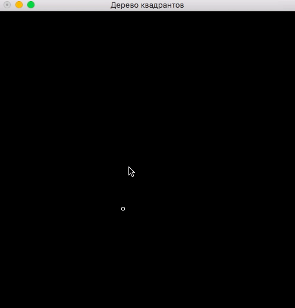

# demo-quadtree

Визуализация дерева квадрантов.



## Сборка и запуск

Клонируйте репозиторий:

```
git clone https://github.com/cmc-haskell-2017/demo-quadtree.git
cd demo-quadtree
```

Соберите проект при помощи [утилиты Stack](https://www.haskellstack.org):

```
stack setup
stack build
```

Собрать проект и запустить игру можно при помощи команды

```
stack build && stack exec demo-quadtree
```

## Задание

В качестве задания к [лекции «Алгебраические типы данных»]() требуется
реализовать [функцию `getRange`](https://github.com/cmc-haskell-2017/demo-quadtree/blob/master/src/QuadTree.hs#L97-L99).

Как только вы реализуете эту функцию, объекты, попадающие в зону выделения будут выделяться.
Выделение работает если зажать левую кнопку мыши и потянуть.
